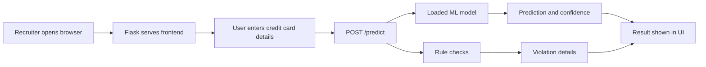
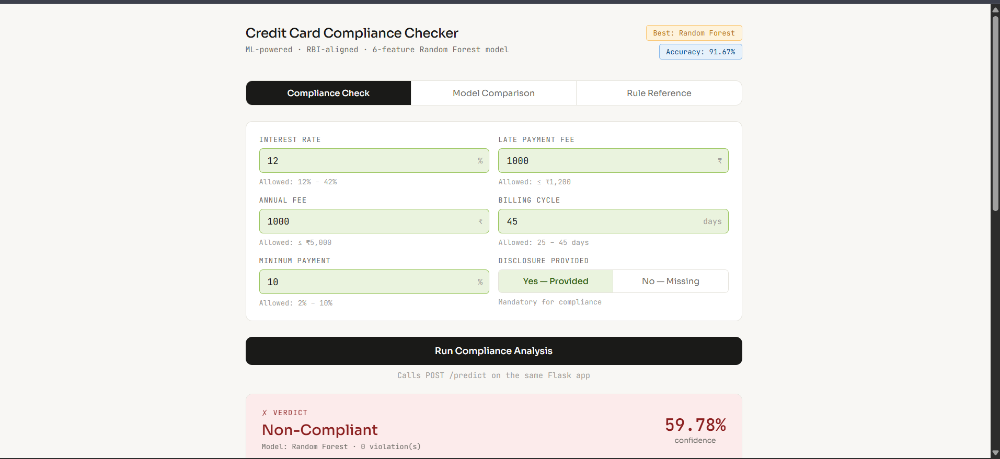
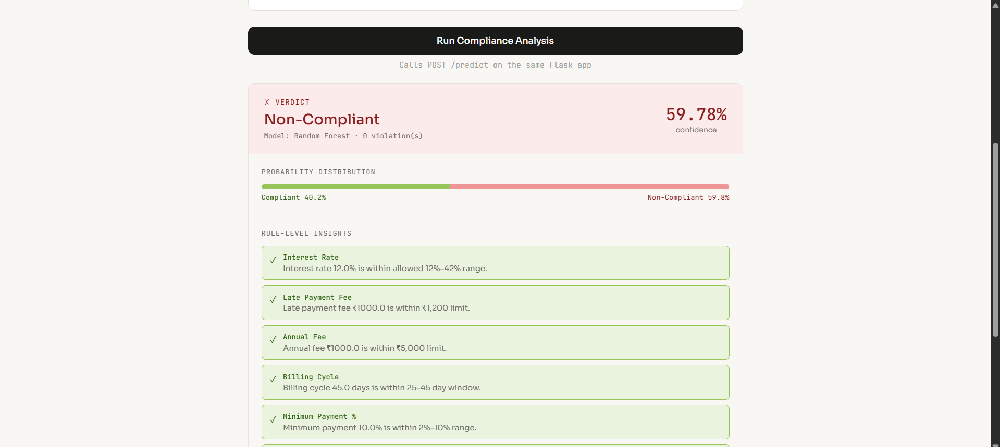
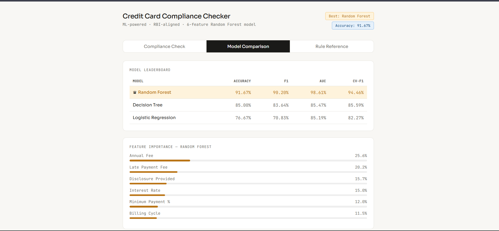
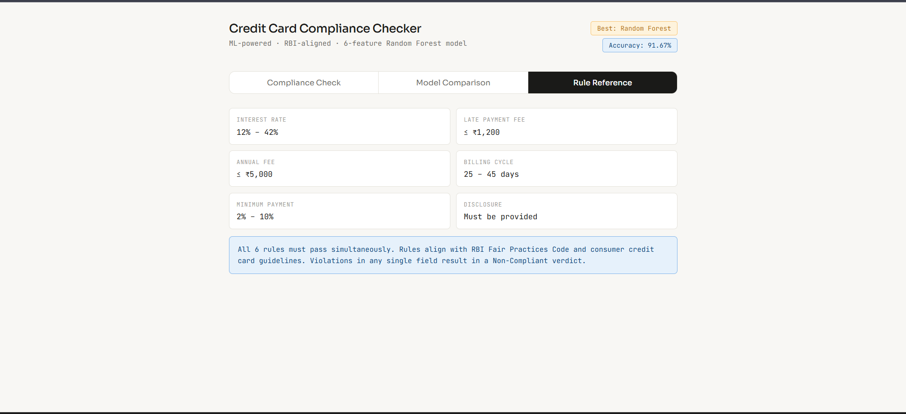

# Credit Card Compliance Checker

A full-stack machine learning project that predicts whether a credit card product is compliant with rule-based consumer credit requirements. The app includes synthetic data generation, model training, a Flask API, and a browser UI served from the same backend.

## What This Project Shows

- End-to-end ML workflow: data generation, training, evaluation, and inference.
- Three model comparison: Logistic Regression, Decision Tree, and Random Forest.
- Flask backend with REST endpoints for prediction, metadata, and health checks.
- Frontend dashboard for entering credit card product details and viewing results.
- Rule-level explanations showing why a product is compliant or non-compliant.

## Demo Flow



## Screenshots


### Compliance Check





### Model Comparison



### Rule Reference



## Project Structure

```text
credit_compliance/
+-- app.py                # Vercel entrypoint
+-- main.py               # Flask app serving both frontend and API
+-- generate_data.py      # Creates synthetic credit card compliance data
+-- train_models.py       # Trains models and saves the best one
+-- dataset.csv           # Generated/training dataset
+-- pyproject.toml        # Python dependencies
+-- requirements.txt      # pip install dependencies
+-- vercel.json           # Vercel routing config
+-- uv.lock               # Locked dependency versions for uv users
+-- models/
|   +-- best_model.pkl    # Saved best model pipeline
|   +-- metadata.json     # Model metrics, rules, and feature importance
+-- frontend/
    +-- index.html        # Browser UI
```

## Requirements

- Python 3.12 or newer
- A modern browser

The trained model is already included in `models/`, so a recruiter can run the app immediately without retraining.

## Quick Run

### Option 1: Using uv

```bash
uv sync
uv run python main.py
```

Then open:

```text
http://localhost:5000
```

### Option 2: Using pip

Windows PowerShell:

```powershell
python -m venv .venv
.\.venv\Scripts\Activate.ps1
pip install -r requirements.txt
python main.py
```

macOS/Linux:

```bash
python3 -m venv .venv
source .venv/bin/activate
pip install -r requirements.txt
python main.py
```

The app runs at:

```text
http://localhost:5000
```

## Deploy On Vercel

This project includes `app.py` and `vercel.json`, so Vercel can detect and run the Flask app.

### Deploy from GitHub

1. Push this project to GitHub.
2. Open `https://vercel.com`.
3. Click `Add New Project`.
4. Import the GitHub repository.
5. Keep the framework preset as `Other`.
6. Click `Deploy`.

### Deploy with Vercel CLI

```bash
npm install -g vercel
vercel login
vercel
```

For production deployment:

```bash
vercel --prod
```

Vercel will install dependencies from `requirements.txt` and route all requests through `app.py`.

## How To Use The App

1. Start the Flask app with `python main.py`.
2. Open `http://localhost:5000`.
3. Enter values such as interest rate, late payment fee, annual fee, billing cycle, minimum payment percentage, and disclosure status.
4. Click `Run Compliance Analysis`.
5. Review the verdict, confidence score, probability distribution, rule violations, and feature importance.

## API Endpoints

### `GET /`

Serves the frontend application.

### `GET /health`

Checks whether the backend and model are available.

Example response:

```json
{
  "status": "ok",
  "model": "Random Forest"
}
```

### `GET /metadata`

Returns model metadata, leaderboard results, feature names, feature importance, and compliance rules.

### `POST /predict`

Example request:

```json
{
  "interest_rate": 24.5,
  "late_payment_fee": 800,
  "annual_fee": 999,
  "billing_cycle": 30,
  "minimum_payment_pct": 5.0,
  "disclosure_provided": 1
}
```

Example response:

```json
{
  "prediction": "Compliant",
  "prediction_label": 1,
  "confidence": 93.73,
  "probabilities": {
    "non_compliant": 6.27,
    "compliant": 93.73
  },
  "total_violations": 0,
  "model_used": "Random Forest"
}
```

## Model Results

| Model | Accuracy | F1 | ROC-AUC | CV-F1 |
|---|---:|---:|---:|---:|
| Random Forest | 91.67% | 90.20% | 98.61% | 94.46% |
| Decision Tree | 85.00% | 83.64% | 85.47% | 85.59% |
| Logistic Regression | 76.67% | 70.83% | 85.19% | 82.27% |

Best model selection uses a composite score:

```text
(Accuracy + F1 + ROC-AUC) / 3
```

## Compliance Rules Used

| Field | Allowed Value |
|---|---|
| Interest Rate | 12% to 42% |
| Late Payment Fee | Up to INR 1,200 |
| Annual Fee | Up to INR 5,000 |
| Billing Cycle | 25 to 45 days |
| Minimum Payment | 2% to 10% |
| Disclosure Provided | Must be yes |

## Retraining The Model

The saved model is already committed, but the full pipeline can be rerun:

```bash
python generate_data.py
python train_models.py
python main.py
```

This regenerates `dataset.csv`, retrains the models, updates `models/best_model.pkl`, and refreshes `models/metadata.json`.

## Notes For Reviewers

- The backend and frontend are connected through `main.py`; no separate frontend server is required.
- The frontend calls the Flask API using same-origin `/predict`.
- The model artifacts are loaded at startup from the `models/` directory.
- The app is designed for local demonstration and portfolio review.
